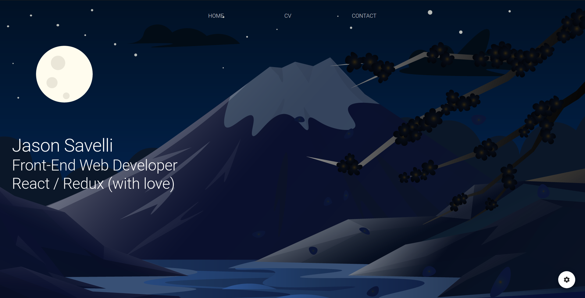

# **Portfolio Front**



## **Qu'est-ce que le projet**

Ce projet est tout simplement mon site personnel. Il me permet de partager mon CV, des projets persos peut être dans le futur, et de pouvoir montrer à qui le souhaite, comment j'aime organiser mon code lors de projet `React`.. J'en profite aussi pour réaliser certaines features que je n'ai pas l'habitude de faire, comme `la gestion de traductions` ou encore le fait d'avoir `plusieurs themes dans une meme application` qui étaient les points de départ de ce projet.

## **Installation du projet**

- `git@github.com:Newpoki/portfolio-v3.git`
- Allez dans le dossier &rarr; `npm i && npm run start` ou `yarn && yarn start`

## **Stack technique**

The whole app is written in `Typescript`, using `React` to render the view, and `Redux` to store the data.
The app is bootstraped with <a href="https://github.com/facebook/create-react-app">create-react-app</a> and some settings are extended with the help of <a href="https://github.com/gsoft-inc/craco">Craco </a> (see below)
Backend is in another GitHub repository, using the <a href="https://strapi.io/">Strapi, Node.JS headless CMS</a> associated with a mongodb database.

### **Lib utilisées**

- <a href="https://github.com/gsoft-inc/craco">Craco </a>pour changer certaines configuration de base du CRA
- <a href="https://material-ui.com/">Material UI</a>pour une bibliothèque de composant complète
- <a href="http://zetcode.com/javascript/dayjs/">DayJs</a> pour la gestion des dates
- <a href="https://redux.js.org/basics/usage-with-react">React Redux</a> pour la gestion centralisée des données
- <a href="https://redux-toolkit.js.org/">Redux Tool Kit</a> pour une utilisation simplifiée et moins verbeuse de redux
- <a href="https://github.com/rexxars/react-markdown">React markdown </a>pour convertir du markdown en composant react
- <a href="https://reacttraining.com/react-router/web/guides/quick-start">React router </a>en tant que router de mon app
- <a href="https://react.i18next.com/t">React i18next </a>pour gérer l'internationalisation du contenu statique
- <a href="https://github.com/nfl/react-helmet">React helmet</a>pour pouvoir configurer certains élements des pages (comme le title)</a>

## **Code style**

As I said before, I'm using `craco` to extend CRA default config, e.g eslint config.

### **Eslint override**

- `"no-duplicate-imports"` &rarr; to avoid importing component from the same library on different line
- `"no-restricted-imports"` &rarr; with a custom config, it allow to restrict import to some function from a path, or even patterns, with a custom error message.
  Thanks to this, I can restrict some function import to force using the custom one (e.g useDispatch and useSelector). Also, I ensure `custom aliases` are used instead of absolute import (usefull for the next rule).

N.B: The patterns restriction should be able to take custom messages, but for an unknown reason, I couldn't make it work. So in the futur, it'd be nice to get this work fine with a custom and message.

- `"import/order"` &rarr; force the imported to be sorted with a custom config `"builtin" -> "external", -> "internal"`. This way, I can rapidly see what's imported from third party lib, or from the app itself.

### **Aliases**

With CRA typescript template, absolut import from `src` are already configured and works well. But with the `import/order` custom config, the absolute import where ordered as third party library imports, and I didn't want this. Anyway, aliases import are sorted with in app import, so that's the way I go.

To setup these aliases, I followed the <a href="https://github.com/risenforces/craco-alias">craco documentation about aliases</a>.
Now this is done, to add a new alias:

- Add it to `tsconfig.extend.json` to get it works.
- Restrict the use of the import you would use before the alias in `.eslintrc.json > rules > no-restricted-imports`

## **Archi type d'un composant**

Tout les composants sont "formatés" de la même manière pour ne pas être perdu en passant d'un à l'autre, et pour des raisons de consistance

```javascript
import thirdPartyLib from '@third-party-lib';

import { CommonComponent } from '~common';
import { ComponentSkeleton } from './commonComponent';

// Prefixed with an I, Sufixed with Props
interface IMonComposantProps {
  param: string;
}

export const MonComposant = ({ param }: IMonComposantProps) => {
  /* Store */

  // All data that comes from redux
  const data = useSelector(selectData);

  /* Vars */

  // All data that comes from hooks (useSelector excluded), utils, etc
  const { t } = useTranslation("NAMESPACE");
  const dispatch = useDispatch();

  /* Derived Vars */

  // All data that is obtained from props, redux hooks, or any other sources
  const color = myUtils(param1, localState)

  /* Callbacks */

  // Most of the callbacks are wrapped in useCallback,
  // But it's not mandatory.
  const myCallback = useCallback((value: string) => {
  dispatch(myAction({key: value}));
  }, [dispatch]);

/* Effects */

  // Effects just in top of the render because this is what impact
  // the more the render. They should be use with a lot of attention
  // and avoided if possible in order to have less undersired side effects
  useEffect(() => {
  dispatch(fetchHomeData({ localeCode }));
  }, [dispatch, localeCode]);

  /* Render */*

  return (
    <Page sx={{ p: 5, justifyContent: { xs: "center" } }}>
      <Typography
        variant="h1"
        sx={{
          fontSize: { xs: 40, md: 60 },
          textAlign: { xs: "center", md: "left" },
          color,
        }}
      >
        {param}
      </Typography>

      <Typography
        variant="h2"
        sx={{
          fontSize: { xs: 20, sm: 25, md: 50 },
          textAlign: { xs: "center", md: "left" },
          color,
        }}
      >
        {data}
      </Typography>

      <Typography
        variant="h2"
        sx={{
          fontSize: { xs: 20, sm: 25, md: 50 },
          textAlign: { xs: "center", md: "left" },
          color,
        }}
      >
        {data.job_libraries}
      </Typography>
    </Page>
  )
}
```

## **Tests unitaires**

The tests are made with <a href="https://jestjs.io/fr/">Jest</a>.
At this point, slice's reducer and utils are tested. Thunks are not tested, as redux-toolkit mainterners do not recommend it.
A needed, important and nice improve, would be to test the hooks, and more importantly, components themself.

## **TODO**

- Mettre à jour le CV au format PDF (erreur numéro téléphone)
